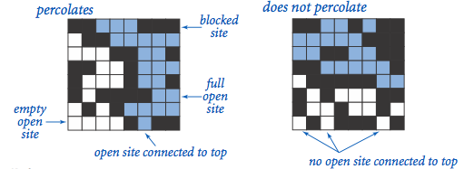

# Programming Assignement 1: Percolation

This is the first programming assignement of the course. The goal is to write a program to estimate the value of the *percolation threshold* via Monte Carlo simulation.

## The model

To estimate this threshold a grid of NxN sites is created, each site can be *blocked* or *open*. A site is *full* if open and connected to the top site. The system *percolates* when the bottom site is connected to the top site.

At each iteration of the program, a new random site is opened and connected to the adjacent ones until the system percolates. The ratio between the opened sites and the closed ones is an estimation of the percolation threshold.

To solve this problem is necessary to implement a quick algorithm to continuously check if the bottom and top site are connected. The book [1] is used as a reference for the algorithm but, apart from that, the code is orginal and some implementations have been made to the structure of the pseudocode available during the course.

## TODO

- [x] Correct open and is_open parameters to be the same (not i,j and index respectively)
- [x] Check if numpy is really necessary (a list() should do it fine)
- [x] Check if the opened list is truly necessary (maybe by marking with -1 or None closed sites?)
- [x] Measure code performance
- [ ] Add comments and check
- [ ] Write the code to measure the constant with confidence intervals
- [ ] Write easy launcher for the program
- [x]  Add percolation readme description

## References

1. R. Sedgewick, K. Wayne - *Algorithms*