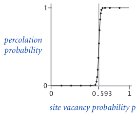

# Programming Assignement 1: Percolation

This is the first programming assignement of the course. The goal is to write a program to estimate the value of the *percolation threshold* via Monte Carlo simulation.

## The problem

Given a composite systems comprised of randomly distributed insulating and metallic materials: what fraction of the materials need to be metallic so that the composite system is an electrical conductor? Given a porous landscape with water on the surface (or oil below), under what conditions will the water be able to drain through to the bottom (or the oil to gush through to the surface)? Scientists have defined an abstract process known as percolation to model such situations.

## The model

The percolation system is modeled using an *N*-by-*N* grid of sites, where each site is either *open* or *blocked*. A *full* site is an open site that can be connected to an open site in the top row via a chain of neighboring (left, right, up, down) open sites. The model percolates if there is a full site in the bottom row or, in other words, if it is possible to fill all open sites connected to the top row and that process fill some open site on the bottom row.

If therefore sites are independently set to be open with probability *p* (and therefore blocked with probability 1−*p*), what is the probability that the system percolates? When *p* equals 0, the system does not percolate; when *p* equals 1, the system percolates. The plots below show the site vacancy probability *p* versus the percolation probability for 20-by-20 random grid (left) and 100-by-100 random grid (right). 

When *N* is sufficiently large, there is a threshold value *p*\* such that when *p* &lt; *p*\* a random *N*-by-*N* grid almost never percolates, and when *p* &gt; *p*\*, a random *N*-by-*N* grid almost always percolates. The goal is therefore to compute the threshold value *p*\*.

## The algorithm

To solve this problem was then necessary to implement a quick algorithm to continuously check if the bottom and top site are connected. The book [1] was used as a reference for the algorithm but, apart from that, the code is original and some custom implementations have been made to the structure of the pseudocode (which was available during the course).

### Usage

To print the results in terms of mean, standard deviation, and confidence intervals (95%), simply run:

	python main.py N T -v

where NxN is the number of the sites in the model and T is the number of tests run for averaging. The verbose option -v is optional to print also the mean time taken by the algorithm averaged over all the tests.

## References

1. R. Sedgewick, K. Wayne - *Algorithms*